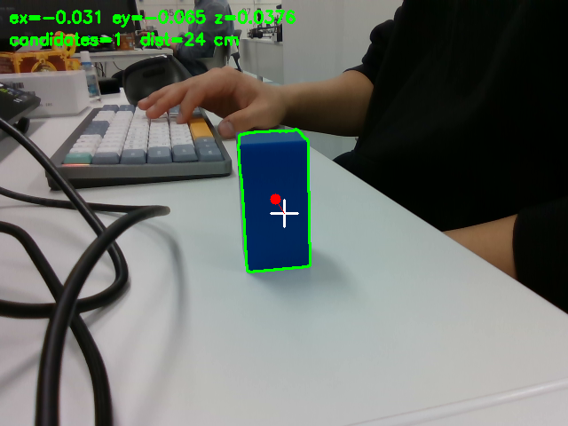
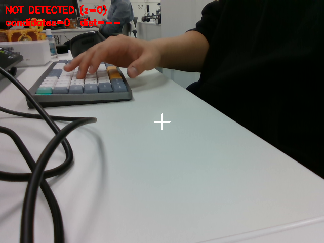
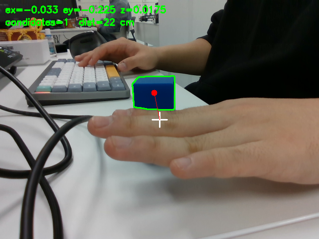

# EYE4 / 아이뻐 — 비전 객체 추적 시스템 보고서

작성: 2026-10-08 / 검증·문서화: 전승혜

## 1. 검증 결론과 범위

팀은 파란색 직사각 기둥형 퍽 1개(팀 설명: 3×6cm)를 RealSense D435로 인식하고 Pan/Tilt 두 축으로 카메라 방향을 제어하는 시스템을 구현했다. 팀 실행 기준은 Raspberry Pi 단일 ROS runtime이며 PC는 SSH 터미널로 사용한다.

제출 자료에서 확인되는 결과는 **이전 버전의 노트북 인지 평가, Raspberry Pi 모의/DRY 연결 기록, OpenCR 단독 LIVE 방향·timeout 기록**이다. 최신 제어·통합 PR에는 실제 LIVE 추적·Kp 비교·복귀를 수행했다는 보고가 있으나, 해당 실행의 원본 CSV·설정·commit·반복 조건은 이번 자료에 포함되지 않았다. 따라서 전체 필수 검증 완료로 판정하지 않는다.

| 표시 | 의미 |
|---|---|
| 원본 확인 | 이번 패키지에 보존한 CSV·로그·이미지에서 확인 가능. 해당 환경·버전에 한정 |
| 팀원 보고 | PR 설명 또는 회고에 기재. 원본 실행 데이터 미확인 |
| 증거 부족 | 요구된 측정 구간·반복·시각·데이터가 없어 완료 판정 불가 |

미확인 값은 0이나 예상값으로 채우지 않았다. 자료가 없다는 이유만으로 팀원이 시험을 하지 않았다고 단정하지 않는다. 상세 완료 증빙 표는 [요구사항 추적표](docs/requirements_traceability.md), 시험별 상태는 [verification_results.csv](results/logs/verification/verification_results.csv)를 참조한다.

## 2. 시스템과 시험 조건

흐름: D435 → RealSense wrapper → perception_node → `/target` → control_node → `/control/pan_tilt_cmd` → opencr_node → OpenCR → Pan/Tilt DYNAMIXEL → 카메라 방향 변화 → 새 영상.

| 항목 | 확인 내용 | 적용 범위 |
|---|---|---|
| 추적 | 좌우 ex·상하 ey를 사용하는 2축 P 제어 | 팀 구현 기준 |
| 인지 입력 | 640×480, 설정 30 fps | 기존 인지 측정 |
| HSV·면적 | [93,120,35]~[130,255,255], min_area_ratio=0.002 | 기존 측정 설정 |
| `/target` | geometry_msgs/msg/PointStamped, x=ex, y=ey, z=면적비; z=0은 미검출 | ZIP 코드·기존 기록 |
| 정규화 오차 | ex=(cx−W/2)/(W/2), ey=(cy−H/2)/(H/2), 오른쪽·아래 양수 | 구현 규약 |
| 명령 | PanTiltCommand, stop·pan/tilt 속도(rad/s) | ZIP 구현 |
| 입력 중단 | target timeout 0.5초, 복귀 신선 목표 3프레임 | 기존 설정·제어 PR 보고 |
| 시험 목표 | 정상 30초, 가림 2초×5회, 입력/제어 통신 중단, Kp 2종 각 3회 | 첨부 발제문·기존 시험 계획 |
| ROS 발견 | DOMAIN_ID=77, LOCALHOST | 첨부 실행 스크립트; Pi 내부 실행 조건 |
| 최신 작업 Kp | Pan/Tilt=0.10/0.10 | 제어 담당자의 후속 시험용 선정 보고; 최적값 입증 아님 |

브리지 timeout·각도 제한·중립값은 버전마다 변경되었다. 기존 ZIP의 bridge 0.15초·보드 300ms·중립 ±80 counts를 최신 장비 설정으로 일괄 인용하지 않는다. 최종 장비에 올라간 펌웨어와 실행 commit의 일치를 확인한 원본 기록은 이번 자료에서 부족하다.

## 3. 문제 1 — HSV·Contour 검출

### 구현

Blur → HSV 변환 → 색 마스크 → 형태학적 잡음 제거 → Contour → 최소 면적 이상 후보 중 최대 면적 1개 → 중심 및 오차·면적비 계산. 검출되지 않으면 x=y=z=0으로 전달하며 이전 좌표를 재사용하지 않는다.

### 기존 이미지와 측정 결과 — 노트북 참고 자료

기존 report는 인지 담당 노트북(Ubuntu 24.04 + ROS 2 Lyrical) 측정이라고 명시한다. 아래 결과를 Raspberry Pi 전체 시스템 성능으로 해석하지 않는다.

| 장면 | 검출 | ex | ey | 면적비 | 근거 |
|---|---|---|---|---|---|
| 정상 | True | -0.0312 | -0.0649 | 0.03758 | [log.csv](results/logs/perception/log.csv) |
| 목표 없음 | False | 0 | 0 | 0 | 같은 CSV |
| 일부 가림 | True | -0.0325 | -0.2246 | 0.01748 | 같은 CSV |

정상 이미지에서 퍽의 윤곽·중심이 표시되고, 목표 없음 이미지에는 NOT DETECTED(z=0)가 표시된다. 일부 가림 이미지에서는 보이는 퍽 부분만 검출되어 면적이 줄고 중심이 위로 치우친다. **이 일부 가림 이미지는 완전 소실 후 정지·복귀를 증명하지 않는다.** 화면 거리 표시는 보조값이며 거리별 반복 시험 결과가 아니다.

| 지표 | 결과 | 근거·한계 |
|---|---|---|
| 사람 대조 검출률 | 30/30=100.0% | [visible CSV](results/logs/perception/eval_visible_20261006_104850.csv), 저장된 human_ok 기준 재집계 |
| 배경 오검출 | 0/10 프레임 | [empty CSV](results/logs/perception/eval_empty_20261006_104942.csv), 저장된 human_ok 기준 재집계 |
| 인지 처리 FPS | 약 30.03 | [인지 로그](results/logs/perception/perception_node_20261006_1043.log), 195개 창의 29,276프레임 / 표기 구간 합 975초; Pi 폐루프 성능 아님 |
| 평가 조건 | visible 약 30~40cm·실내 조명·목표 이동, 동일 배경 empty | [eval_runs.csv](results/logs/perception/eval_runs.csv) |

검출률은 저장된 사람 판정을 재집계한 결과이고 모든 평가 이미지의 독립 재판정을 새로 수행한 것은 아니다. 세 장면 이미지는 이번 문서 작성에서 확인했다. 깊이 기록이 붙은 정적 장면과 컬러 기준 평가 로그는 별도 실행으로 구분한다. Depth gate 적용 후 또는 최신 통합 commit의 인지 성능은 재확인되지 않았다. 최소/기준/최대 거리별 비교 수치는 없다.

## 4. 문제 2 — 인지·제어 연결

기존 모의/DRY 시험은 중심·좌우·상하·미검출·토픽 침묵을 입력하고 명령·상태를 확인했다.

| 시험 | 확인 범위 | 원본 |
|---|---|---|
| Pi 분리 프로세스 DRY | 7개 입력·복귀·제어 종료 처리 | [시험 기록](results/logs/control/ros_repository_dry_20261006_170913/test_notes.md) |
| PTY 시리얼 연결 | STOP·복귀·입력 침묵·제어 종료·자동 재ARM 없음 | [시험 기록](results/logs/control/serial_bridge_stop_fix_20261006_182228/test_notes.md) |
| 실제 OpenCR USB DRY | 입력별 원시 명령·정지 상태 | [시험 기록](results/logs/control/serial_usb_seven_20261006_195242/test_notes.md) |

이는 이전 코드의 제어/통신 확인이다. DRY의 정지 명령은 실제 움직이는 모터의 정지 지연 측정값이 아니다. 최신 통합 PR의 연결 확인은 팀원 보고로 추가 기록하며, 현재 버전의 반복 재검증으로 대체하지 않는다.

## 5. 문제 3 — 실제 2축 제어와 Kp 비교

기존 OpenCR 단독 LIVE 시험은 zero, pan-left/right, tilt-up/down, both를 확인했다. [시험 메모](results/logs/opencr/integration_live_20261006_141057/test_notes.md)는 담당자의 실제 방향 관찰을 기록하지만, 당시 ROS bridge와 카메라 추적은 연결하지 않았다고 명시한다.

제어 담당 PR은 Pan Kp 0.05/0.10을 비교하고 Tilt는 0.10으로 유지했다고 보고한다. 운전자 관찰로 후속 시험 설정 0.10/0.10을 선정했다. **두 설정별 3회씩 총 6회, 동일 거리·이동 순서, 오차 CSV·그래프·RMSE의 원본이 제공되지 않아 정량 비교 완료로 판정할 수 없다.**

통합 담당 PR의 LIVE tracking·Pan/Tilt 확인과 제어 담당의 카메라 LIVE 시험은 구현 진전의 보고로 인정한다. 다만 영상 폴더를 열지 못했고 최신 로그도 없어 정상 추적 30초, 실제 영상 오차 감소, 최신 제한값의 적합성은 독립 확인하지 못했다.

## 6. 문제 4 — 성능·소실 복구·안전

| 요구 시험 | 이번 자료의 판정 | 완료할 수 없었던 이유 또는 증거 부족 |
|---|---|---|
| Pi 정상 추적 30초 | 증거 부족 | LIVE 보고는 있으나 30초 구간의 동기화된 영상·추적 CSV·설정이 없음 |
| Pi FPS·수평/수직 RMSE·유효 추적 비율 | 산출하지 않음 | Pi 폐루프 원본 추적 CSV 없음. 노트북 FPS를 대체 사용하지 않음 |
| 가림 2초×5회 | 증거 부족 | 복귀 보고만 있음. 5회 시작·재등장·복귀 시각·실패 회차 기록 없음 |
| 복구 성공률·시간 | 산출하지 않음 | 분모 5회와 영상 재등장 시각을 확인할 수 없음 |
| `/target` 입력 중단 실기 | 증거 부족 | 이전 DRY는 있으나 최신 LIVE 중단·상태 전이·물리 정지의 연결 기록 없음 |
| 제어 통신 중단 실기 | 부분 근거 | 이전 OpenCR 단독 timeout 기록 있음. 최신 ROS 전체 체인의 중단 시험 원본은 없음 |
| 모터 Bus_Watchdog·경계 정지 | 최신 버전 판정 보류 | 변경·revert 이력 및 PR 설명이 혼재. 최종 펌웨어와 실기 기록 일치 미확인 |

기존 [both.log](results/logs/opencr/integration_live_20261006_141057/both.log)에는 VEL ACK(0.353초), TIMEOUT(0.655초), STOPPED(0.807초), 이후 STATUS의 VEL=0,0·TORQUE=1,1이 기록된다. 이는 통신 로그의 보드 보고 상태이며 **ACK부터 이벤트까지의 간격을 실제 물리 정지 시간으로 쓰지 않는다.**

기존 USB DRY 장시간 시험에서는 ROS_COMMAND_TIMEOUT FAULT가 기록됐다. [오류 발췌](results/logs/control/serial_usb_seven_20261006_195242/first_fault_excerpt.txt)를 보존한다. 당시 세부 지연 원인은 확정되지 않았고, 최신 제어 PR은 비동기 CSV·상태 발행·신선도 설정 변경을 보고한다. 해당 개선 이후 원본 자료가 없어 해결 완료라고 단정하지 않는다.

## 7. 검증 미완료 회고

자료에서 확인되는 검증 방해 요인은 단일 원인이 아니라 카메라 입력, 제어 명령, 준비/ARM, 펌웨어 버전과 경계 처리의 연결 문제였다. 상세는 [원본 회고](results/verification_sources/노드%20실행시%20모터가%20안돌아갔던%20이슈%20회고록.md)를 참조한다.

| 현상 | 자료에 기록된 원인·대응 | 검증 영향 |
|---|---|---|
| `Requires a fresh BOOT state` | 새 BOOT 없이 prepare 재호출. reset 후 BOOT 확인 필요 | 구동 준비 단계가 막혀 정상 추적 시험을 진행할 수 없음 |
| `Requires a fresh stop=false ROS command` | 유효 제어 명령 확인 전 ARM | 인지 TRACKING만으로 모터 구동을 가정할 수 없음 |
| `SUPPORT_AT_NEUTRAL SUPPORT_CAMERA` | 실제 위치와 고정 중립 불일치 | prepare 실패로 실기 측정 차단 |
| 각도 끝에서 정지 후 재추적 불가 | 기존 LIMIT에서 ARM 해제. 가역적 제한 변경 후 revert 기록 | 목표 재등장 복구와 경계 정지의 재ARM을 구분해야 함 |
| 카메라 노드는 있으나 영상 없음 | D435 USB 연결 불안정, 재연결 후 약 30Hz 관찰 보고 | 인지·명령이 나오지 않아 추적 측정 중단 |
| 펌웨어 빌드 실패 또는 소스/보드 불일치 가능성 | 잘못된 FQBN 사용. compile과 실제 upload를 구분해야 함 | 수정 코드의 효과를 보드 동작으로 입증하기 어려움 |
| 외부 PC에서 토픽·서비스 안 보임 | LOCALHOST 발견 범위 | 관찰·진단 실패 가능. 같은 Pi의 SSH 터미널에는 LOCALHOST 사용 가능 |
| 통신 신선도 FAULT | 제어 PR은 시리얼·상태·CSV 지연을 조사했다고 보고 | 최신 개선의 효과를 검증하려면 전후 원본 실행 기록 필요 |

회고에 따르면 `3270103`에서 실행 시 정지 위치 기준 보정과 추적 한계 확대를 적용했고, `be2cf59`의 가역적 LIMIT 변경은 `98d8684`에서 되돌렸다. 이는 **회고 작성 시 dev/test1의 설명**이다. 이번 ZIP에서 이 commit들을 확인하거나 현재 main에 반영됐는지 검증하지 않았다. 통합 PR의 reversible limit stop 검증 보고와 동일 버전으로 합치지 않는다.

회고의 약 30Hz는 카메라 토픽 발행 관찰 보고이며, 정량 Pi 인지 FPS 또는 30초 폐루프 결과가 아니다. 실행 스크립트는 재실행 절차이지 실행 성공 로그가 아니다. 시간이 늦어져 추가 실측 대신 제출 자료를 정리했으며, 이번 문서 작성에서 새 하드웨어 시험을 수행하지 않았다.

개선점은 Kp를 높이기 전에 카메라→target→명령→BOOT/prepare→READY→ARM을 단계별 확인하고, checkout·설치 설정·업로드 바이너리·실행 로그에 동일 commit/run_id를 연결하는 것이다. 기록기와 영상은 시험 전에 시작하고 정상/가림/중단 시험을 별도 run으로 남겨야 한다. 회고 기록은 완료 증거를 대신하지 않는다.

## 8. 문제 5 — 영상·bag·재현·협업

[시연 영상 공유 폴더](https://drive.google.com/drive/folders/1tOibtMF1Q7g7146O-sqSVVbWGnd0sBoK?usp=sharing)가 제공됐다. 공유자는 발제 조건에 맞는 영상이 필요하면 재촬영해야 할 수 있다고 안내했다. 이번 작성에서는 폴더 내용을 열지 못해 파일명·기간·조건 충족 여부를 판정하지 않았다.

성공·소실 bag의 metadata.yaml·데이터 파일·SHA-256·재생 출력은 미제공이다. 통합 PR의 replay 분석 기능은 기능 구현 보고이며 실제 bag 재현 성공을 의미하지 않는다. [recordings/README.md](recordings/README.md)에 이 상태를 기록했다.

| 팀원 | 제출 자료에서 확인한 기여 | 증거 범위 |
|---|---|---|
| 김상화 | HSV·Contour 및 기존 이미지·평가 CSV·인지 로그 | 노트북 인지 측정 원본 |
| 조민혁 | 2축 제어·시리얼·펌웨어·commissioning, Kp 비교와 LIVE 개선 보고 | 이전 로그 + 최신 PR 설명 |
| 한상준 | launch·Pi 통합·LIVE 복구·runtime origin/limit·replay 보고 | 최신 PR 설명·통합 회고 |
| 전승혜 | 요구사항별 증거 분류, 기존 CSV 재집계, 참고 이미지와 실패 회고 연결, 검증 문서 통합 | 이번 문서·검증 상태 CSV |

실제 PR·Issue·리뷰 URL은 제공되지 않았으므로 임의 링크나 승인 기록은 만들지 않았다. 위 역할 설명은 team.md의 기존 기여 기록을 대체하지 않는다.

## 9. 한계·최종 판단

이전 단계의 인지 및 제어/통신 부분 결과는 증거와 함께 제시했다. 최신 LIVE 통합 작업은 팀원 보고로 남겼다. 반복 조건을 갖춘 Kp 비교, Pi 30초 성능, 5회 소실 복구, 최신 LIVE 중단 시험, bag 재현은 증거가 부족하다. 실패·미완료 원인을 기록했으나 전체 필수 완료 기준 충족으로 표시하지 않는다.

AI는 제출 문서와 원본 자료 분류·정리에 사용했다. 새 실측값·영상 판정·장비 성공 결과를 생성하지 않았다.
